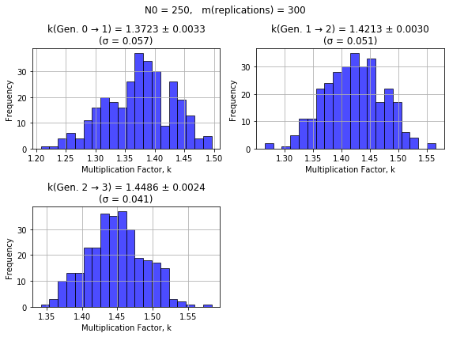

# Project 03: Chain Reaction

## *1. Project overview*

Using Monte Carlo techniques, you are going to simulate Uranium 235 fission. Specifically, you are going to investigate which factors lead to sustained fission via the multiplication factor $(k)$, which is the average number of neutrons per fission event that go on to cause another fission event. When $k=1$, the chain reaction is self-sustaining

## *2. Backstory*

You have been transported back in time (again!) this time to Enrico Fermi's office at the University of Chicago in 1942. Fermi is hard at work trying to build the first self-sustaining artificial nuclear reaction using Uranium 235. Once he calms down from the shock of witnessing time travel, Fermi has asked for your help to explore how factors such as size, shape and purity impact the ability of a sample of Uranium 235 to sustain a chain reaction.  

## *3. A simplified model of fission*

Fermi has done some initial calculations using a simplified model of fission and suggests you build a Monte Carlo simulation based on his simplified model.

When a $^{235}U$ nucleus undergoes nuclear fission in this simplified model, it always releases exactly two neutrons. As long as a given neutron remains inside the Uranium sample, it will travel an average distance---known as the Mean Free Path $λ$---before being captured by a nucleus. In this model, every captured neutron results in a new unstable $^{235}U$ nucleus where the neutron was captured, and that nucleaus then immediately undergoes its own fission process, releasing further neutrons. 

### 3.1. Multiplication factor, $k$

Fermi describes a quantity called the multiplication factor $(k)$ to characterize the steady-state behaviour of the nuclear chain reaction. This quantity represents the average number of neutrons from each fission event that cause further fission events, with the following three categories:

* $k<1$: Subcritical (the reaction dies out),
* $k=1$: Critical (the reaction is self-sustaining), or
* $k>1$: Supercritical (the reaction grows exponentially).

Please see Appendix 1 in this document for a discussion of multiplication factor examples.

### 3.2. Monte Carlo algorithm for the simplified system

You and Fermi discuss the Monte Carlo algorithm for the simplified system and come up with the following. Some starter code is provided at the end of this document to provide concrete examples of generating random directions and travel distances. This includes some initial parameters described in the next section.

**Algorithm for the simplified system:**

1. Choose an initial number of moving neutrons to simulate, $N_0$ (zeroth generation).<br><br>
2. Randomly generate $N_0$ starting locations within the Uranium for these initial neutrons.<br><br>
3. Randomly generate the directions of travel, in three dimensions, of the $N_0$ initial neutrons.<br><br>
4. Using the Mean Free Path $\lambda$, generate the distances, $L$, that the $N_0$ initial neutrons would each need to travel in the sample before being captured. This distance travelled comes from the probability, $p(L)∝e^{\textstyle -L/λ}$, of a neutron being captured when it travels a distance $L$. You do not need to impliment this $p(L)$ equation directly in your code since the following code sjows how to determine this distance based on Mean Free Path: <br><br>
&nbsp;&nbsp;&nbsp;&nbsp;`L = -mean_free_path*np.log(np.random.random(N))`<br><br>
    * The mean free path inside Uranium 235 fission is $\lambda = 2.65 \text{ cm}$ in the simplified model. This is a simplification of a much more complicated way of describing mean free path, where in reality the likelihood of interaction between the neutrons and the Uranium depends strongly on the neutron's energy. <br><br>
5. Determine how many of the neutrons remain inside the sample after travelling their distances, $L$ in their random direction. Neutrons that remain inside the sample after traveling their distance $L$ are considered to have been captured and will initiate a new fission event where they were captured. Neutrons that do not remain inside the sample after traveling their distance $L$ are lost and will not initiate any further fission events.<br><br>
6. Determine the number of new neutrons generated, $N_1$ (first generation, a.k.a. the children), knowing that each fission event will generate 2 new neutrons.<br><br>
    * Keep in mind that each pair of new neutrons is generated at the locations where its parent was captured, not at random locations. Thus you need to the information about where the parent stopped if it stopped within the sample.<br><br>
7. With each of the $N_1$ neutrons, generate their random directions of travel and distances $L$. Determine how many of these $N_1$ neutrons are absorbed inside the sample and then determine the number of second generation neutrons, $N_2$ (second generation, a.k.a. the grandchildren), that are produced by the $N_1$ neutrons. Again, neutrons from the new generation are produced where the previous ones were captured. <br><br>
8. Repeat this same process to determine how many neutrons, $N_3$, there are in the third generation (a.k.a. the great-grandchildren).<br><br>
9. Repeat the full three-generation experiment ($N_0$ to $N_3$) a total of $m_\text{replications}$ times. For each generation, you can use the mean and the standard deviation of the $(k)$ values across $m_\text{replications}$ to characterize the system, where the standard deviation can be treated as the uncertainty, $\delta k$b

### 3.3. Example results for the simplified system with of a cube of side length $a = 10.0 \text{ cm}$, $N_0 = 250$ initial neutrons and $m_\text{replications}$ = 300

This example shows the results going from each generation going to the next ($k_{01}$, $k_{12}$ and $k_{23}$), and uses the average, standard deviation and standard uncertainty of the mean of the multiplication factor $k$ across the $m_\text{replications}$ to characterize the system. 

Check that your (mean ± uncertainty in the mean) values of $k_{01}$, $k_{12}$ and $k_{23}$ are consistent with those from Figure 1. 

You will likely find that it takes up to a few minutes to simulate a data set using $N_0 = 250$ and $m_\text{replications} = 300$.



> **Fig. 1.** Example multiplication factor results for a Uranium 235 cube of side length $a = 10.0 \text{ cm}$, with $N_0 = 250$ initial neutrons. Each of the three panels shows the multiplication factor going from one generation to the next, with each replication representing one data point. The title of each plot shows the mean ± standard uncertainty in the mean (standard deviation divided by $\sqrt{m}$) of the multiplication factor for that generation, across all replications. It also shows the standard deviation (σ).

## 4. *Project details*

### 4.1. Stage 1: Homework 17 - Ensuring your simple model of the system is working correctly (Due Wed., Nov. 05)

In this homework assignment you will build the basic version of the simulation to reproduce the results from Figure 1. See Homework 17 for further details.

### 4.2. Stage 2: A first, very early draft of your project for peer feedback (Due Mon., Nov. 17)
 
Submit a very early draft of your project using the Project 03 Report Template notebook. This draft should show initial development of your project ideas and contain the following, at minimum:

1. A preliminary investigation showing how the system changes in response to changes in one of the parameters in the system---such as those discussed in Section 5.1.<br><br>
1. A short paragraph at the beginning of the notebook discussing how you plan to expand your preliminary investigation into a complete project, and a summary of what direction you are planning to take your research question.

### 4.3. Stage 3: A complete draft of your project (see the syllabus for project deadlines)
 
#### 4.3.1 *Developing and completing your project*

1. Do not include any of the work focusing on the simple model---such as Homework 17---in your final project report.<br><br>

1. Develop a research question that you find interesting and which can be answered with your simulation. As a reminder, this will typically start as a more general research question that you will refine as you start to engage with your investigation in greater detail.
   * As a minimum expectation, we expect you to incorporate at least two elements into your system that add complexity, either through additional physics or parameters that you vary systematically in your investigations.<br><br>

1. Produce a project report (a computational narrative in Jupyter notebook form) using the Project 03 template (it is a copy of the Project 01 template). This project report should ask and answer your research question, with the body of the providing the evidence and information needed to support your answer to the research question. The [Assessment Overview](https://physics210.github.io/p210-2025/Project01-instructions_and_assessment.html#5-assessment-overview) from the Project 01 Instructions applies for this project as well, and lays out the key features that should be in this report. <br><br>

 
#### 4.3.2 *Key project formatting details*
 
1. It should start with an Introduction or Overview to provide the reader with a brief overview of the project, your research question and the context needed to make sense of your research question.<br><br>

1. It should end (before acknowledgements, bibliography or appendices) with a Summary of Results or Conclusion, which should remind the reader what you research question was and then provide the answer to it. This section should refer back to the evidence in the rest of the project to support your answer. This section should also include a discussion of limitations, and the next steps you would take with this project if you had more time.<br><br>

1. In between the two sections described above should be the main body of your investigation, consisting of the markdown and code cells needed to describe what is going on, and to perform the actual investigation. Ensure that your code would be easy for a peer to follow through the a combination of descriptive variable names, comments in your code, and/or a descriptive "code block summary" written in Markdown before the code block. It is often a good idea to break your code into smaller code block within the notebook so that it is easier to summarize the purpose of each chunk of code.<br><br>

1. Make use of section titles to help orient and guide the reader.<br><br>

1. A single- or multi-panel visualization should provide the main evidence / information used to answer your research question. For most research questions, this visualization will represent the findings of your simulation as you vary one or more parameters in your simulation (such as initial velocity). Make effective use of titles, annotations and/or captions so that the reader can easily understand and correctly interpret your visualization.<br><br>

1. An Acknowledgements section that provides attribution for the help you received in completing your project. This section MUST INCLUDE a statement regarding if and how generative AI was used in completing your project. 
   * If you **did not** use generative AI in completing your project, a statement such as "generative AI was not used to support any aspect of the work submitted in this project report."
   * If you used generative AI, describe how you used it. You should be specific about whether you used it to generate initial code/text, to modify code/text, to troubleshoot code and/or to revise text, and which specific code blocks or sections of text benefited from your use of generative AI. As a reminder, use of generative AI to support your work is allowed, but the expectation is that you have made significant intellectual contributions toward the final project that you submit.<br><br>

1. A bibliography of any references cited in your project. The formatting of the bibliographic information is not strict. It just needs to be sufficiently easy for a person to track down your source based on the information provided. <br><br>

1. You should use inline citations to indicate which bibligraphic entry is being used as a source for all equations, data, figures, theories, or ideas that aren't your own original work or aren't common knowledge in physics. For example: "Recent measurements show the Hubble constant to be 67.4 km/s/Mpc [1]." Have a look at almost any page on Wikipedia to see how inline citations are used and connected to the biblography.<br><br>

1. As an appendix to your project report, share 2-3 ways that you validated the behaviour of your simulation. By this we mean we want you to put some energy into convincing yourself that your simulation behaves as you intended, from the perspective of the physics and the code. In the process of building and debugging your simulation you will have used some combination of common sense, by-hand calculations, visualizations, debugger interactions and lots of targeted print statements to build up your confidence that things are all behaving correctly. We don't need to see every single one of these validation tasks. Instead, we are asking you to highlight the 2-3 most compelling of these validation / debugging / error-testing steps or tasks. Unlike with Project 01, we do not require a comparison with a by-hand calculation for this project.<br><br>

1. As a second appendix in your project report, answer a series of reflection questions (provided in the Project 03 Report Template). These questions are designed to help you check your project report against the criteria and expectations before submission and to help us better understand where you extended yourself in completing this project.

## *5. Your investigation: Exploration of the multiplication factor, $k$*

1. Fermi's main task for you is to explore how the multiplication factor $k$ varies as a function of factors such as the size, shape or purity of the sample. Suggestions for other factors you could vary are listed below.  You should start by coming up with general research question(s) that explore(s) the behavior of $k$ over the phase space of this system, and then making visualizations that provide insight into these general research question. Based on these initial investigations, refine your research question(s) and your investigations until you feel like you have produced the evidence needed to provide effective answers to your refined research questions. 

If you choose to implement any physical extensions, it would be good for your visualizations to include some exploration or demonstration of what their effects are.

It is up to you how to incorporate generation number into these investigations. For example, you may wish to restrict the $k$ values you use to only multiplication factor when going from the second-to-final to the final generation. Or you may wish to incorporate into your investigation how the results evolve based on generation number or at which generation number they become stable.

### 5.1. Some parameters that you could vary as well as places to extend the physics of the simulation

* **Shapes and aspect ratios:** The shape of the sample, which could include fundamentally different shapes, such as spheres, cylinders, and rectangular prisms (boxes). A helpful way to characterize the relative dimensions of a given shape (other than spheres and cubes) is the Shape Aspect Ratio, $S$. For a rectangular prism with volume $a \times a \times b$, the Shape Aspect Ratio would be $S=a/b$. For a cylinder it would be $S=r/h$. Compare how different shapes and/or different Shape Aspect Ratios impact $f$.
* **Volume:** The volume of the sample, $V$.
* **Probability that captured neutrons initiate further fissions:** The purity of the Uranium sample can be modelled by introducing a probability that the neutron will be captured by a $^{235}U$ nucleus and result in a subsequent fission. In Fermi's simplest model, we treated it as $p=1.0$ that a neutron stopping within the sample would cause a subsequent fission, but you can explore the impact of varying the purity of the sample via this parameter.
* **Mean free path:** Although you might be inclined to try to use the neutron mean free path as an adjustable parameter, varying this parameter would have the inverse relationship to varying the volume, so any such investigation could be performed by varying the volume. 
* **Number of neutrons per fission:** Although we used two neutrons per fission in Fermi's simplest model, the average number of neutrons produced per $^{235}U$ fission is actually 2.4355.
* **Generations:** Once can vary the total number of generations and incorporate generation number into an investigation in a vareity of ways. 
* **Even more physics, coding and investigation extensions:** There is a lot of room to extend this project, which is a huge simplification of a nuclear chain reaction. One could account for the fact that more than one neutron would have been generated at each location when generating our initial batch of neutrons, could consider surrounding the sample with nuclear reflectors, could simulate multiple generations of fission events, could vary parameters such as $N_\text{neutrons}$ and $m_\text{replications}$ in your phase space to do careful characterizations of uncertainty, and more.

## *Appendix 1. Starter code*

The starter code below is the result of some initial brainstorming with Fermi. It shows how to generate a neutron at a random position within the cube of Uranium, and then generate a random direction (in 3D) and travel distance for the neutron. 

Some additional functionality you should consider:

* Move it from generating a single neutron, to $N_0$ neutrons. Recall that all of the `np.random` functions take array shape as their final positional argument. For example, you can generate $N_0$ initial positions using `x0 = np.random.uniform(0, a, N0)`. Or if you wanted a multi-dimensional position array you could use `r0 = np.random.uniform( 0, a, (3, N0) )`.
* It is likely you will want to move some of this functionality to functions, especially as you generate multiple neutrons and propagte them across multiple generations.

Additional notes:

* The method used of generating a random direction in 3d may seem a bit counterintuitive. Try searching or asking GenAI about this using a phrase such as "pick a random point on the surface of a sphere with a uniform distribution."
* It is best to use very low numbers for `N0` and `replications` as you build and test your code so that you are not waiting around forever while developing your code. Once you want to check results, increase these value up to or close to the final values you wish to use.

```python
# Length of the cube's side
a = 10.0 # cm

# Fermi's best guess of the mean free path
# based on the neutron cross section in U235
# across many energies
mean_free_path = 2.65 # cm

# Generate a random initial decay position for each neutron
# - These positions will only be random for the Generation 0 neutrons
x0 = np.random.uniform(0, a)
y0 = np.random.uniform(0, a)
z0 = np.random.uniform(0, a)

# Generate random initial directions for each neutron
phi = np.random.uniform(0, 2 * np.pi)
costheta = np.random.uniform(-1, 1)
theta = np.arccos(costheta)

# Randomly generate the distance travelled for a neutron 
# before it is absorbed. This comes from the proabability 
# p(L) ∝ e^{-L/λ} that a neutron will be captured after
# travelling a distance L
d = np.random.exponential(mean_free_path)

# ... (determine final positions, etc)
```

## *Appendix 2. Multiplication factor examples*
Let's use the simple model to discuss multiplication factor examples. 

We start with $N_0 = 250$ neutrons moving around inside the sample. Each of those neutrons that stops inside the sample generates two new neutrons at the locations where these neutrons were captured, where each of these neutrons could potentially cause more fission events. If the sample was infinitely large, such that no neutrons can escape the sample, the original $N_0 = 250$ neutrons will produce $N_1 = 500$ neutrons, which will then produce $N_2 = 1000$ neutrons, and so on. In this situation, our maximum multiplication factor is $k = 2$, since there is an average of two neutrons from each fission even that can cause further fission events. $k$ is just counting the multiplication factor relating the number of neutrons in the sample when going from generation 0 ($N_0 = 250$) to generation 1 ($N_1 = 500$), which is $k(0-1) = 500/250=2$. It is important to note that in this extreme example, $k(0-1) = k(1-2)$ and so on, but in reality the multiplication factor can change as the generations progress.

Conversely, the minimum possible $k$ is 0, which would correspond to an infinitely small sample where all of the starting neutrons leave the sample and produce no further neutrons.

Finally, a multiplication factor of $k=1$ corresponds to a situation where the average number of neutrons present in a new generation is the same as the number present in the previous generation. In the simple model, this would correspond to on average, every fission event resulting in one neutron that escapes the sample and one neutron that remain in the sample to generate a new fission event. 
